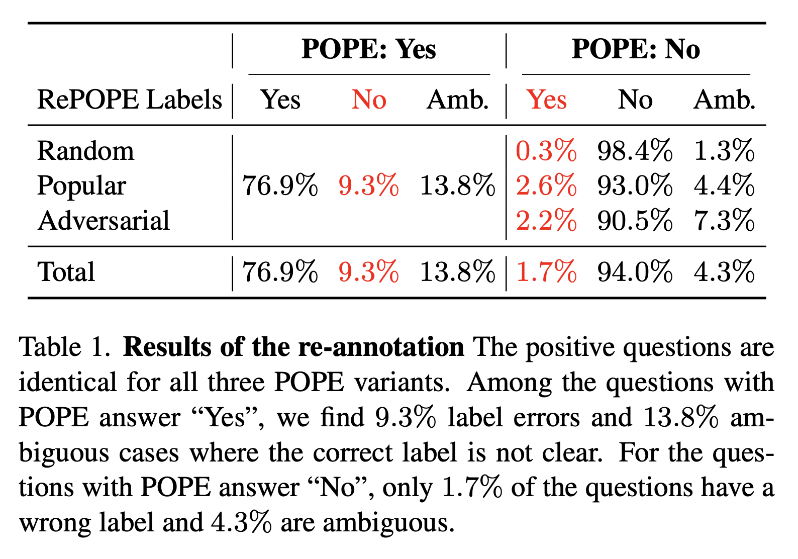

# RePOPE: Impact of Annotation Errors on the POPE Benchmark

**Yannic Neuhaus**, **Matthias Hein**

**Tübingen AI Center - University of Tübingen**

**[RePOPE Annotation Files](#annotations)** | **[Requirements](#setup)** | **[arXiv](https://arxiv.org/abs/2503.23573)** | **[Citation](#citation)**

## RePOPE
We introduce RePOPE, a relabeling of the commonly used object hallucination benchmark COCO POPE. We correct wrong annotations and remove ambiguous ones. The imbalance between incorrect "Yes" and incorrect "No" labels (9.3% vs 1.7%) has a significant effect on the F1 scores.

  

## Examples

  

## RePOPE Annotation Files
We provide the corrected annotation files in the same format as the original POPE files:

    annotations/coco_repope_random.json
    annotations/coco_repope_popular.json
    annotations/coco_repope_adversarial.json

## Requirements
Install the conda environment as follows to reproduce the results using our code:

    conda create --name repope python=3.12
    conda activate dash
    conda install nvidia/label/cuda-12.1.0::cuda-nvcc
    pip install -r requirements_pip.txt
    pip install flash-attn

## Model Evaluation
You can run the following command to evaluate a model on POPE and RePOPE. Supported models can be found [here](./assets/available_models.md).
   
    CUDA_VISIBLE_DEVICES=<GPU index> python src/evaluate.py --vlm_name <VLM name> --bs <batchsize> &
